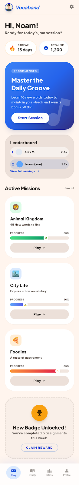
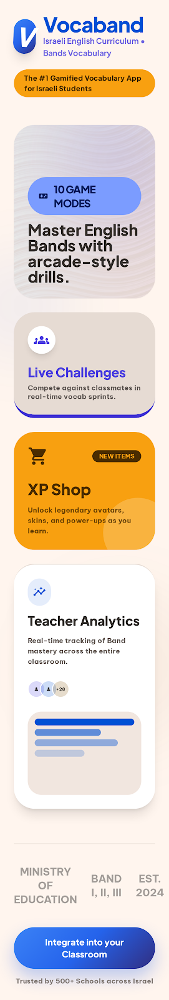
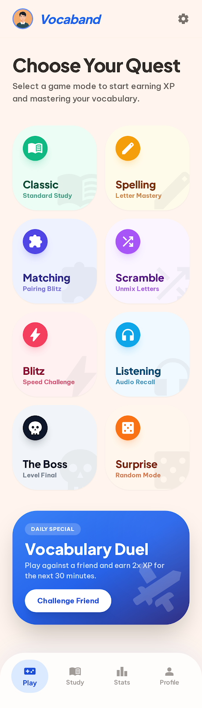

# Vocaband

> **Vocabulary learning that actually sticks** — a gamified classroom platform for Israeli EFL students (grades 4–9) and their teachers.

[🌐 www.vocaband.com](https://www.vocaband.com) · [📜 License](./LICENSE) · [🔐 Security Policy](./SECURITY.md) · [📨 contact@vocaband.com](mailto:contact@vocaband.com)

---

> ⚠️ **Source-available, not open-source.**
> This code is published under **MIT License with Commons Clause** — see [LICENSE](./LICENSE) for the full text.
>
> ✅ You may read, study, and learn from this code
> ✅ You may fork it for **non-commercial educational use**
> ❌ You may **not** sell it, host a paid service derived from it, or rebrand it as your own product
>
> For commercial licensing inquiries: **contact@vocaband.com**

---

## What it does

Vocaband turns vocabulary drills into a short, competitive classroom experience. Students join a class with a 6-character code (or scan a QR code for a Quick Play session — no account needed), pick from **10 interactive game modes**, and their progress streams live to the teacher's dashboard.

Every word is available in **English + Hebrew + Arabic** so the UI fits Israel's two dominant first languages, fully RTL-aware. Curriculum-aligned across **Set 1 / Set 2 / Set 3** (CEFR A1 → B2).

No app store. No personal data required for students. Works on any device with a browser.

---

## Table of contents

- [Screenshots](#screenshots)
- [Why Vocaband](#why-vocaband)
- [Features](#features)
  - [Game modes](#-10-game-modes)
  - [For teachers](#-for-teachers)
  - [For students](#-for-students)
  - [Quick Play](#-quick-play--qr-scan-no-login)
  - [Live Challenge](#-live-challenge--classroom-competition)
  - [Analytics](#-analytics-that-matter)
- [Accessibility](#accessibility)
- [Privacy & security](#privacy--security)
- [Getting started (users)](#getting-started-users)
- [License](#license)
- [Acknowledgments](#acknowledgments)

---

## Screenshots

<table>
  <tr>
    <td align="center"><b>Landing page — meet Vocaband</b></td>
  </tr>
  <tr>
    <td></td>
  </tr>
</table>

<table>
  <tr>
    <td align="center"><b>Teacher dashboard — Quick Play, Classroom, Approvals</b></td>
  </tr>
  <tr>
    <td></td>
  </tr>
</table>

<table>
  <tr>
    <td align="center"><b>Student experience — pick a mode, pick a language, play</b></td>
  </tr>
  <tr>
    <td></td>
  </tr>
</table>

> More screenshots in [`docs/screenshots/`](./docs/screenshots/) — accessibility toolbar, high-contrast mode, classroom analytics panels, and more.

---

## Why Vocaband

| Feature | Vocaband | Typical vocab apps |
|---|---|---|
| Trilingual (English / Hebrew / Arabic) | ✅ Built-in, RTL-aware | ❌ Rarely |
| Quick Play — QR scan, no login | ✅ Yes | ❌ No |
| Live classroom competition | ✅ Real-time leaderboard | ❌ No |
| No student account needed | ✅ Join by class code + name | ❌ Registration required |
| Game modes | ✅ 10 built-in | ❌ 1–2 max |
| Smart word matching (paste, OCR, AI translate) | ✅ Deep | ❌ Manual only |
| Teacher analytics (per-word mistakes) | ✅ Per-student, per-word | ❌ Basic |
| Accessibility (WCAG 2.0 AA, IS 5568) | ✅ 10-feature toolbar | ❌ Limited |
| Aligned to Israeli MoE curriculum | ✅ Set 1 / Set 2 / Set 3 | ❌ Generic |
| Adjustable display size for teachers | ✅ A / A / A toolbar control | ❌ Browser zoom only |

---

## Features

### 🎮 10 game modes

| Mode | Description |
|---|---|
| **Classic** | See the English word, hear it pronounced, choose the correct translation |
| **Listening** | Audio only — no text shown. Trains the ear |
| **Spelling** | Hear the word and type it correctly in English |
| **Matching** | Connect Hebrew/Arabic words to their English translations |
| **True / False** | Quick reflexes: decide if the word–translation pair is correct |
| **Flashcards** | Self-paced review — flip cards to see answers, no scoring pressure |
| **Word Scramble** | Unscramble mixed-up letters to form the English word |
| **Reverse** | See the Hebrew/Arabic word, pick the English translation |
| **Letter Sounds** | Phonics — each letter lights up and sounds out |
| **Sentence Builder** | Tap words in the correct order to build sentences from the vocabulary |

Teachers can restrict which modes are available per assignment or Quick Play session.

---

### 👩‍🏫 For teachers

- **Quick Play** — Generate a QR code for instant vocabulary sessions. Students scan and play; no login required. Live podium with leader-change celebration chime, kick-student control, and a final-results modal.
- **Class management** — Create classes with shareable 6-character codes (WhatsApp-friendly). Rename classes and pick curated avatars any time without disturbing students or progress.
- **Assignment builder** — Pick from thousands of curriculum words, upload a `.docx`, paste a list, snap a photo (OCR), or pick from **46 curated topic packs** (Animals, Food, Family, Weather, Sports, House Rooms, Opposites, At the Doctor, Money & Shopping, Daily Routine, In the City, Holidays & Celebrations, Tools & Gadgets, Question Words, Greetings, and 31 more).
- **Saved templates** — Tick "Save as template" on any assignment and reuse the exact words + modes + settings in one tap from the dashboard.
- **Saved word groups** — Saving a template also saves its words to "Saved Groups" so future assignments can pick them up instantly.
- **Smart paste** — Paste words from any source. Exact matches auto-add; fuzzy matches show as click-to-add suggestions. Hebrew + Arabic paste supported.
- **AI translation** — Custom teacher words are automatically translated to Hebrew and Arabic.
- **Word families** — Toggle to see related forms (happy → happier, happiness) as suggestions.
- **Mode control** — Choose which of the 10 modes each assignment includes.
- **Sentence Builder config** — 4 difficulty levels with auto-generated sentences from your vocabulary.
- **Approvals queue** — New students sign up with "Request Account"; teacher approves from the dashboard tray (auto-refreshed so new requests appear without reloading).
- **Display-size control** — A / A / A buttons in the top bar scale the entire interface up to 138% for older eyes or projector view. Persists per device.
- **First-time guide** — Step-by-step onboarding tour highlights every dashboard feature for new teachers.

---

### 🎓 For students

- **Join instantly** — Class code + name + emoji avatar. No email, no password.
- **Returning or new** — Clear "I'm returning / I'm new" toggle on the login screen.
- **Language choice** — Hebrew or Arabic, chosen on first game, remembered thereafter.
- **10 game modes** — Each assignment can include any subset of the 10.
- **XP, streaks, badges** — "Perfect Score", "Streak Master", "XP Hunter" and more.
- **Mode intro screens** — Brief instructions in English, Hebrew, or Arabic before each game.
- **Cumulative session scoring** — Quick Play sessions accumulate points across multiple modes for a fair leaderboard.
- **Motivational feedback** — Audio + visual encouragement on correct answers.

---

### ⚡ Quick Play — QR scan, no login

Teachers pick words, hit Launch, and students scan a QR code to join instantly. What's shipped:

- 6-character session code + QR code side by side
- All 10 game modes selectable per session (teacher's choice is respected end-to-end)
- Real-time teacher monitor with live podium
- Leader-change celebration chime
- Live connection indicator so teachers know if updates are instant or fallback
- Polling fallback keeps the podium fresh even if real-time is degraded
- Teacher can kick a student mid-session; kicked students see a clear screen with a "rejoin with a different name" path
- Final-results screen for students — rank + top-3 mini podium highlighting "(you)"
- Custom teacher-added words supported alongside curriculum words (with AI translation)
- Per-session cumulative scoring — students keep their points across the modes they play

---

### 🏆 Live Challenge — classroom competition

A real-time competition mode for whole classes. Students join their class channel, the teacher broadcasts a word set, and the leaderboard updates live as answers come in.

- Ranked top-3 podium with crown animation and medal badges
- Leader-change chime
- Final-results modal when the teacher clicks "End Challenge"
- Connection-status pill + auto-reconnect with jittered back-off

---

### 📊 Analytics that matter

- **Reports dashboard** — Per-week trend chart, top struggling words across roster, plays-per-day histogram, attendance grid (✓/· per student per day for the last 14 days).
- **Performance matrix** — Every student × every assignment, color-coded by score. Click any cell to see details.
- **Most-missed words** — Which words students get wrong most, with Hebrew/Arabic translations and which students missed each one.
- **Students needing attention** — Auto-identifies students scoring below 70% or with high mistake rates.
- **Score by game mode** — Bar chart of average performance per mode, so you know what to practice next.
- **Student profiles** — Score trend chart, class average comparison, most challenging words, full attempt history.
- **Gradebook** — All students with expandable score details, mistake counts, and last-active dates.
- **CSV + PDF export** — Full reports in either format. CSV is UTF-8 with BOM (renders Hebrew/Arabic correctly in Excel); PDF embeds Noto Sans fonts so non-Latin names render correctly with right-aligned RTL.

---

## Accessibility

Vocaband meets **WCAG 2.0 Level AA** and **Israeli Standard IS 5568**:

- 10-feature accessibility toolbar (font size, high contrast, grayscale, inverted colors, dyslexia font, line spacing, reduce motion, underline links, highlight focus, reading guide)
- Full keyboard navigation with skip links and visible focus indicators
- Screen reader support: ARIA landmarks, labels, live regions
- Full RTL support for Hebrew and Arabic (layout mirrors, text aligns right, bidirectional safe)
- Accessibility statement in English, Hebrew, and Arabic at `/accessibility-statement`
- Teacher display-size control (A / A / A) for projector / older-eyes use

---

## Privacy & security

- **No personal data required for students** — class code + first name + emoji is enough.
- **Teacher accounts are allowlisted** — applications are reviewed manually before access is granted.
- **Trilingual privacy policy** at [/privacy-policy](https://www.vocaband.com/privacy-policy) (English, Hebrew, Arabic).
- **Vulnerability disclosure** — see [SECURITY.md](./SECURITY.md). Responsible disclosure encouraged; report privately to [contact@vocaband.com](mailto:contact@vocaband.com).
- **Public audit summary (redacted)** — [SECURITY_AUDIT.md](./SECURITY_AUDIT.md).

Specific operational and infrastructure details are intentionally omitted from public documentation. For commercial integrations or detailed security questions, please reach out via [contact@vocaband.com](mailto:contact@vocaband.com).

---

## Getting started (users)

**Teachers:** visit [www.vocaband.com](https://www.vocaband.com), sign in with Google (your email must be allowlisted — contact us at [contact@vocaband.com](mailto:contact@vocaband.com) for access), create a class, and share the 6-character code with your students.

**Students:** go to [www.vocaband.com](https://www.vocaband.com), tap "I'm a student", enter the class code your teacher gave you, pick your name (or tap "I'm new" to request a new account — your teacher approves it), then start playing.

**Quick Play (no account, no class):** when your teacher launches Quick Play, scan the QR code they show on their screen, pick a name, and start playing immediately.

---

## License

[MIT License with Commons Clause](./LICENSE).

Source-available for personal, educational, and non-commercial use. Commercial use, resale, hosting as a paid service, or integrating into a proprietary product requires a separate commercial license — reach out to [contact@vocaband.com](mailto:contact@vocaband.com).

---

## Acknowledgments

- Vocabulary lists derived from the **Israeli Ministry of Education English curriculum** (Sets 1–3)
- Hebrew + Arabic font support powered by Google's **Noto Sans** family
- Every teacher and student who has tested the app and told us what to fix next
