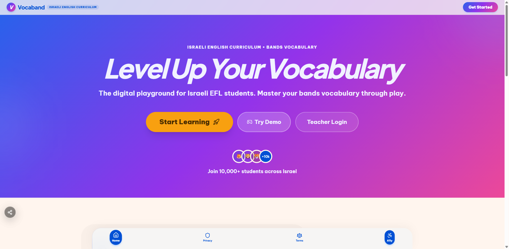
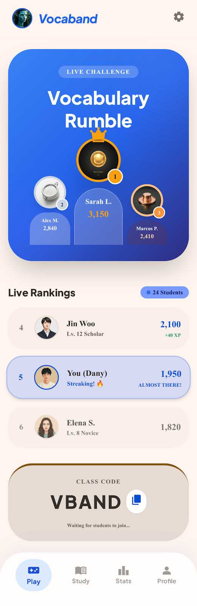

# Vocaband — Why Schools Choose It

> A sales-ready breakdown of pros, cons, and the value Vocaband delivers to
> **teachers**, **students**, and **school managers**. Use this to walk a
> principal or English coordinator through the product in one sitting.

---

## At a glance

Vocaband is a gamified English-vocabulary platform built specifically for
**Israeli schools, grades 4–9**, aligned with the Ministry of Education
vocabulary curriculum (Set 1 / Set 2 / Set 3) and translated into
**Hebrew** and **Arabic**.

| In one number | What it means |
|---|---|
| **6,482 words** | Full MoE-aligned vocabulary library, every word with audio |
| **15 game modes** | The same word practised in 15 different ways — no boredom |
| **3 languages** | English, Hebrew, Arabic with full RTL support |
| **EU-hosted** | Frankfurt region, GDPR + Israeli Privacy Law (Amendment 13) |
| **0 ads** | No advertising, no third-party data sharing, no commercial tracking |

---

## Pros — for **Teachers**

The everyday English teacher gains time, visibility, and control.

- **Class setup in under a minute.** Create a class, hand out the class
  code, students join. No parent emails, no IT department, no
  registration nightmare.
- **Curriculum-aligned content out of the box.** Sets 1, 2, and 3 are
  pre-loaded — assign by unit, by week, or by theme. You don't have to
  build a word list from scratch.
- **Bring your own word lists.** Have a textbook the school uses? Snap
  a photo with the in-app camera — OCR reads the Hebrew/Arabic page
  and Vocaband auto-translates it into a custom assignment.
- **Automatic grading and feedback.** The app checks answers, awards
  XP, and gives the student instant feedback. You stop spending Sunday
  nights marking vocabulary quizzes.
- **Per-student progress reports.** See exactly who is struggling, who
  is bored, who is racing ahead. Filter by class, date, mode, or word.
- **Live Challenge mode.** Run a 5-minute classroom sprint with a
  real-time leaderboard on the projector. Engagement jumps; classroom
  energy lifts.
- **Quick Play with a QR code.** Start an instant class activity in 30
  seconds — students scan, play, leave. No accounts required for
  spontaneous warm-ups.
- **Audio on every word.** Native-quality pronunciation in English —
  helpful for teachers who don't speak English as a first language and
  for students who learn by ear.
- **Hebrew + Arabic translations everywhere.** Weaker students get the
  meaning in their first language and stay in the lesson instead of
  falling behind.
- **Teacher badges and recognition.** Cosmetic milestones for classes
  taught, students engaged — small but real motivation for staff.

## Pros — for **Students / Learners**

The whole product is designed to make a 12-year-old *want* to do
vocabulary homework.

- **15 game modes, same words.** Classic, Spelling, Matching, Scramble,
  Listening, Memory Flip, Sentence Builder, Fill-in-the-Blank,
  True/False, Word Chains, Idioms, Speed Round, and more. Variety kills
  boredom.
- **XP, levels, streaks.** Every correct answer pays out XP; a daily
  streak counter rewards consistency.
- **Avatars, titles, themes, frames.** A real cosmetic shop with
  Common / Rare / Epic tiers, paid for with XP — never real money.
- **Pet evolution.** An 8-stage companion pet that grows from Egg to
  Celestial Beast as the student levels up.
- **Power-ups.** XP Booster, Weekend Warrior, Streak Freeze, Lucky
  Charm, Focus Mode — small toys that make the loop feel alive.
- **Retention mechanics that actually help.** Daily chest, weekly
  challenge, comeback bonus — gentle nudges back to practice without
  feeling pushy.
- **Live Challenge on the classroom screen.** Compete head-to-head
  against classmates in real time — the kind of moment kids talk about
  at break.
- **Hebrew & Arabic translations.** Students who struggle with English
  get an instant first-language hint and never have to give up.
- **Audio for every word.** Tap and hear it — learners who can't decode
  text yet can still progress.
- **Works on a phone, tablet, or Chromebook.** Installable as a PWA
  (looks and feels like a native app) — works on whatever the student
  has at home.
- **No ads, ever.** No banners, no pop-ups, no influencer noise. The
  app stays focused on learning.

## Pros — for **Managers (Principals & Coordinators)**

What gives a principal or English coordinator confidence to roll this
out across a whole school.

- **One dashboard, all classes.** See vocabulary progress for every
  class, every cohort, in one view — instead of asking each teacher.
- **Objective data, not gut feelings.** XP earned, words mastered,
  accuracy %, time-on-task, streak rates — measurable, comparable
  across classes and over time.
- **Early-warning signals.** Spot at-risk students *before* the MEITZAV
  / Meitzav-equivalent test, while there is still time to intervene.
- **Reports for parents and inspectors.** Export progress reports for
  parent-teacher nights and ministry visits.
- **Hosted in the EU (Frankfurt).** GDPR-compliant from day one;
  satisfies Israeli Privacy Protection Law and Amendment 13.
- **Built for safety.** Row-Level Security (RLS) at the database
  guarantees students can't see each other's data; teachers only see
  their own classes.
- **Independently penetration-tested.** Periodic external security
  audits documented in the project record.
- **No advertising, no upsell to children.** Cosmetic shop uses in-game
  XP only — no real-money purchases anywhere in the student flow.
- **Google sign-in (optional).** Teachers and older students can use
  school Google accounts; younger students stay on simple class-code
  login.
- **Scales without IT work.** A school doesn't need to install or
  maintain anything — it's a web app that updates itself.
- **A platform, not just an app.** The same engine extends to Hebrew
  as a second language, Arabic, vocabulary for science / history /
  Bible, and additional languages on the roadmap — one tool, more
  subjects later.
- **Risk-free pilot.** Free for one class for a full month. Expand if
  it works, walk away if it doesn't.

---

## Cons — what to be transparent about

Selling well means not pretending the product is perfect. Acknowledge
these directly when asked — it builds trust.

- **Requires internet during gameplay.** Local progress is preserved
  offline, but fresh assignments and live leaderboards need
  connectivity. A school with weak Wi-Fi will feel it.
- **Currently English-only (vocabulary side).** Hebrew/Arabic UI is
  complete, but the *vocabulary content* is English. Other-subject
  vocabulary banks (Hebrew L2, Arabic, science, history) are on the
  roadmap, not shipped.
- **Mobile-first design.** Game screens look great on phones and
  tablets; some teacher wizards (e.g. OCR cropping for custom word
  lists) work better on a larger screen.
- **Teacher needs ~30 minutes to learn the dashboard.** Self-service is
  fine, but adoption is best when a Vocaband rep walks the lead teacher
  through the first class setup. We offer this free.
- **Cosmetic shop can distract a small minority.** For most students it
  drives motivation; a few will spend time browsing avatars. The
  shop can be disabled per class if a teacher prefers.
- **Custom-word audio takes a few minutes to generate.** Words from
  uploaded lists get audio via an automated pipeline — usually within
  minutes, but it isn't instant.
- **Optimised for Israeli MoE curriculum.** Schools using a non-MoE
  syllabus can still use custom lists, but Sets 1–3 won't match
  one-to-one.
- **Live Challenge needs ~24 students max per session for the best
  experience.** Larger groups still work, but the leaderboard becomes
  harder to read on a single screen.
- **PWA install nudge varies by device.** iOS and some Android browsers
  surface the "install" prompt differently — students may need a
  one-line instruction from the teacher.

---

## How to position it in a 5-minute pitch

| Audience | One-line hook |
|---|---|
| **Teacher** | "Less grading, more teaching — automatic checking and progress reports." |
| **Student** | "15 games, same words, no boredom — and you keep what you earn." |
| **Principal** | "Real data on every student, before MEITZAV — not gut feelings." |
| **Safety officer** | "Frankfurt-hosted, GDPR + Amendment 13, no ads, pen-tested." |
| **The future** | "English today. Every subject that needs memorisation, tomorrow." |
| **The close** | "One class. One month. Free. We set it up with you." |

---

## Suggested supporting collateral

- **Hebrew / Arabic version of this pitch:** `docs/SCHOOL-PRESENTATION.md`
- **Pricing and packaging:** `docs/PRICING-MODEL.md`
- **Go-to-market plan:** `docs/GO-TO-MARKET.md`
- **MoE compliance brief (HE):** `docs/MOE-COMPLIANCE-BRIEF-HE.md`
- **Security overview:** `docs/SECURITY-OVERVIEW.md`
- **Pre-made PDF decks:** `public/Vocaband-Presentation-HE.pdf`,
  `public/Vocaband-Presentation-AR.pdf`,
  `public/Vocaband-OnePager-AR.pdf`

---

## Screenshot inventory used in this doc

| File | What it shows |
|---|---|
| `vocaband-homepage.png` | Marketing landing page hero |
| `docs/screenshots/screen.png` | Student dashboard — streak, XP, daily mission, leaderboard, active missions |
| `docs/screenshots/screen1.png` | Feature overview card — 10/15 game modes, Live Challenges, XP Shop, Teacher Analytics |
| `docs/screenshots/screen2.png` | "Choose Your Quest" — game mode selection screen |
| `docs/screenshots/scree3n.png` | Live Challenge — podium and real-time class ranking |

> **Note for sales asset refresh:** the feature-overview card
> (`screen1.png`) currently says "10 game modes". The app ships **15**
> — refresh this graphic before the next print run.
